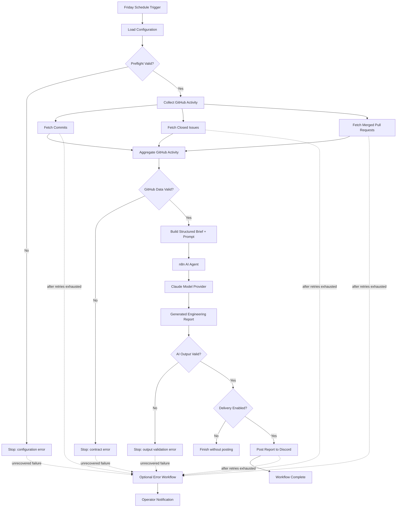

# Weekly GitHub Dev Summary — Production-Hardened n8n Automation

A working n8n automation that collects a GitHub repository's weekly engineering activity, generates a factual narrative summary with Claude, and delivers the report to Discord.

The project includes both a straightforward reference implementation and a **production-hardened "Bulletproof" edition** with validation, retry behavior, controlled delivery, and optional failure notifications.

## What it does

Every Friday, the workflow:

1. Fetches the week's commits from GitHub.
2. Fetches closed issues.
3. Fetches merged pull requests.
4. Normalizes the activity into a structured payload.
5. Uses an n8n AI Agent with Claude to create a concise engineering report.
6. Validates the AI output before delivery.
7. Posts the finished report to Discord.

The report is designed to stay evidence-based. The prompt explicitly prevents the model from inventing developer intent, project health, causes, architecture, or unsupported predictions.

## Why this project is different

A workflow that succeeds once is not necessarily ready to operate reliably.

The hardened implementation adds controls for the conditions that typically make automations brittle in production:

- **Preflight validation** before external calls
- **GitHub response-contract validation** before the data reaches the AI layer
- **AI output validation** before a report is delivered
- **Retries** for transient GitHub and Discord failures
- **Configurable delivery** so successful report posting can be disabled without changing workflow logic
- **Optional Error Trigger workflow** for failure notifications
- **Explicit stops** when required data or expected output is missing

This separates transient provider failures from invalid data and workflow-contract failures.

## Included workflows

### `workflows/01-reference-openrouter.json`

The live-tested reference implementation.

- n8n AI Agent
- Claude Sonnet 4 through OpenRouter
- GitHub commits, closed issues, and merged PRs
- EN/FR report support
- Discord delivery
- Retry behavior on external HTTP calls

### `workflows/02-bulletproof-main.json`

The production-oriented implementation.

Adds:

- preflight configuration validation
- GitHub response validation
- AI report validation
- external-call retries
- switchable success delivery
- explicit failure behavior

### `workflows/03-optional-error-handler.json`

A separate n8n Error Trigger workflow that can notify an operator when the main workflow fails.

It captures useful operational context such as:

- workflow name
- execution ID
- last executed node
- error message
- execution URL when available

Notifications can be disabled without modifying the main workflow.

### `workflows/04-reference-direct-anthropic.json`

An exact-model reference using n8n's native Anthropic Chat Model with:

`claude-sonnet-4-20250514`

This variant is included to demonstrate direct Anthropic integration. The end-to-end live test was performed with the OpenRouter version because Anthropic API credits were not available during development.

## Architecture

The diagram below shows the **Bulletproof main workflow as one execution path**. A decision node has only one Yes path and one No path. Where several GitHub calls are required, the successful path moves into a collection stage that fans out to those calls and then rejoins before validation.

### How to read the diagram

**One successful path out of each decision.** Preflight validation does not have three separate Yes outcomes. A valid configuration enters one collection stage; that stage then makes the three GitHub requests required for the report.

**Parallel collection, then one handoff.** Commits, closed issues, and merged pull requests are separate inputs, but they rejoin at `Aggregate GitHub Activity`. Downstream validation and AI processing operate on the combined weekly evidence.

**One model provider per workflow execution.** `Claude Model Provider` represents whichever model connection is configured in that workflow. The live-tested reference uses OpenRouter; the direct-Anthropic reference uses Anthropic. They are alternatives, not two model calls made during the same run.

**Retries belong to the external calls.** GitHub and Discord calls can retry transient failures. If those retries are exhausted, the workflow fails and the optional Error Workflow can notify an operator. Validation errors are not retried blindly.

**Validation occurs before and after AI.** GitHub data is checked before it becomes an AI prompt, and the generated report is checked before it can be delivered. A green API response by itself is not treated as proof of a valid business result.

See [`docs/architecture.md`](docs/architecture.md) for the deeper design rationale and reliability decisions behind each stage.

## Example report structure

The generated weekly report contains:

- **Development Activity** — commit themes plus chronological dates/timestamps when available
- **Issues and Pull Requests** — factual counts and notable titles
- **Notable Patterns** — observations directly visible in the data
- **What to Watch Next** — comparisons future reports can make, without speculative predictions

## Setup

### OpenRouter / live-tested version

1. Import `workflows/01-reference-openrouter.json` into n8n.
2. Configure a GitHub credential and an OpenRouter credential.
3. Replace the placeholder Discord webhook URL.
4. Set the repository and language in the Configuration node.
5. Execute manually, verify the output, then activate the schedule.

### Bulletproof version

Import `workflows/02-bulletproof-main.json`. If failure alerts are desired, also import `workflows/03-optional-error-handler.json` and assign it under **Workflow Settings → Error Workflow**.

### Direct Anthropic version

Import `workflows/04-reference-direct-anthropic.json` and configure an Anthropic credential in n8n.

## Security

No reusable secrets are included in this repository.

The workflow exports use placeholders for:

- GitHub credentials
- OpenRouter credentials
- Anthropic credentials
- Discord webhook URLs

Never commit live API keys, access tokens, or webhook URLs to a public repository.

## Origin

This project was originally developed in response to the Claude Builders Bounty **Issue #5: n8n + Claude automated weekly dev summary**.

Submission PR: **claude-builders-bounty/claude-builders-bounty#3759**

The bounty requirements provided the baseline functionality. The Bulletproof Edition goes beyond the minimum requirements to demonstrate how the same automation can be operated with stronger validation and failure controls.

## Built with

- n8n
- GitHub REST API
- n8n AI Agent
- Claude Sonnet 4
- OpenRouter
- Anthropic API reference integration
- Discord webhooks

## Author

**Johnathan Lightfoot**  
Bulletproof Automations

This repository is intended as a portfolio example of production-minded workflow engineering: not just whether an automation can run, but whether it can behave predictably when inputs and external services do not.